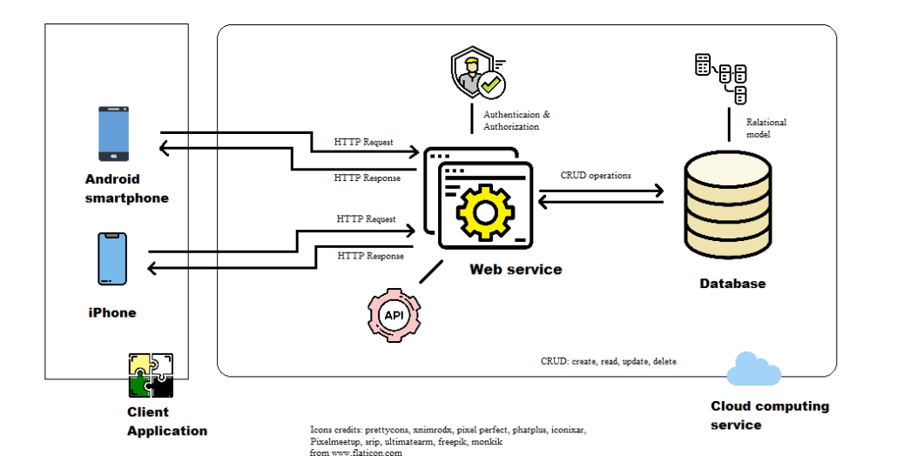

# PlanDone

Diploma thesis: Cross platform mobile app development with cloud database. 

The thesis presents process of mobile application development for Android and iOS platforms, with usage of cloud services, allowing the user to create to-do lists. 

The system architecture created in project:

Each elemenent was designed and implemented. The source code is available in this repository. 

